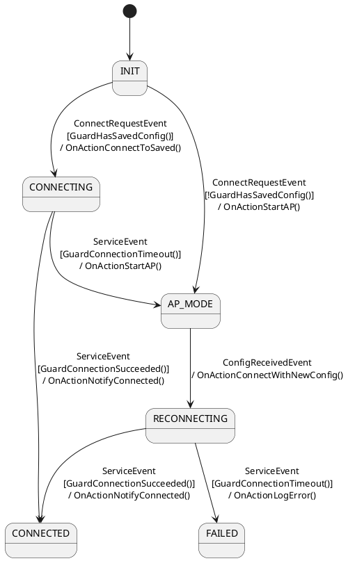

# State

| State          | Entry Function          | Exit Function        | Description (optional)                          |
| -------------- | ----------------------- | -------------------- | ----------------------------------------------- |
| `INIT`         | `OnEntryInit()`         | `OnExitInit()`       | Initial state, performs system/init setup       |
| `CONNECTING`   | `OnEntryConnecting()`   | `OnExitConnecting()` | Attempting to connect using saved config        |
| `AP_MODE`      | `OnEntryAPMode()`       | *(none)*             | Starts AP mode for user configuration           |
| `RECONNECTING` | `OnEntryReconnecting()` | *(none)*             | Attempts connection using newly received config |
| `CONNECTED`    | `OnEntryConnected()`    | *(none)*             | Device is successfully connected                |
| `FAILED`       | `OnEntryFailed()`       | *(none)*             | Connection attempts have failed                 |

---

# Event

| Event                 | Triggered From            | Description                                  |
| --------------------- | ------------------------- | -------------------------------------------- |
| `ConnectRequestEvent` | External trigger          | Request to initiate a Wi-Fi connection       |
| `ConfigReceivedEvent` | In AP (Access Point) mode | User submitted a new Wi-Fi configuration     |
| `ServiceEvent`        | Periodic system call      | Performs routine checks and background tasks |

# Action

| Action Name                      | Description                                             |
| -------------------------------- | ------------------------------------------------------- |
| `OnActionConnectToSaved()`       | Initiates connection using saved Wi-Fi credentials      |
| `OnActionStartAP()`              | Switches device to AP mode for user setup               |
| `OnActionNotifyConnected()`      | Notifies system that connection succeeded               |
| `OnActionConnectWithNewConfig()` | Connects using user-supplied credentials (from AP mode) |
| `OnActionLogError()`             | Logs error or takes failure handling actions            |

---

# Guard

| Guard Name                 | Description                                            |
| -------------------------- | ------------------------------------------------------ |
| `GuardHasSavedConfig()`    | Returns true if valid saved Wi-Fi configuration exists |
| `GuardConnectionSucceeded` | Returns true if connection is succeeded                |
| `GuardConnectionTimeout`   | Returns true if connection is timed out                |

# FSM Diagram

