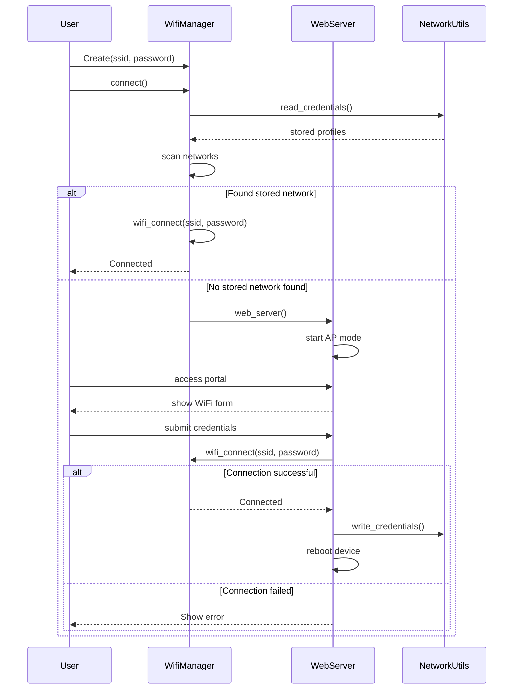

```mermaid
sequenceDiagram
    participant User
    participant WifiManager
    participant WebServer
    participant NetworkUtils
    
    User->>WifiManager: Create(ssid, password)
    User->>WifiManager: connect()
    
    WifiManager->>NetworkUtils: read_credentials()
    NetworkUtils-->>WifiManager: stored profiles
    
    WifiManager->>WifiManager: scan networks
    
    alt Found stored network
        WifiManager->>WifiManager: wifi_connect(ssid, password)
        WifiManager-->>User: Connected
    else No stored network found
        WifiManager->>WebServer: web_server()
        WebServer->>WebServer: start AP mode
        
        User->>WebServer: access portal
        WebServer-->>User: show WiFi form
        
        User->>WebServer: submit credentials
        WebServer->>WifiManager: wifi_connect(ssid, password)
        
        alt Connection successful
            WifiManager-->>WebServer: Connected
            WebServer->>NetworkUtils: write_credentials()
            WebServer->>WebServer: reboot device
        else Connection failed
            WebServer-->>User: Show error
        end
    end

```